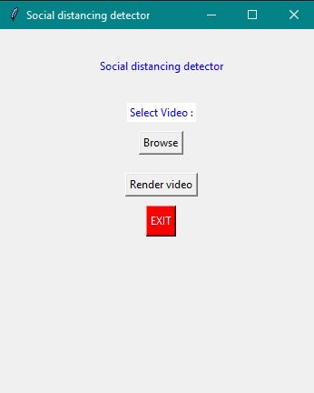

# Social Distancing detector

An advanced detector that can detect humans realtime as well as it can process a pre-recorded video.

## Technologies used

* Python
* OpenCV
* YOLOv3

## Features

* Real time detection
* With or without GPU detection
* Easy to use GUI
* Highly user friendly with all details provided

## Screenshot

* GUI screen image

## Instructions

* Install all required libraries
* If Nvidia GPU is present set USE_GPU to True in setting/socail_distancing_config.py ( GPU improves rendering )
* If no video is selected it would start using your webcam by default for realtime capturing
* Minimum distance can be changed at MIN_DISTANCE in setting/socail_distancing_config.py
